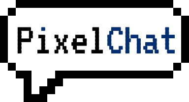

# PixelChat

A habbo-like web chat application. I've used the habbo imaging api to get the avatars from habbo.es. Then I draw them in a **canvas** as well as the room. There is no avatar customization but you can change the avatar whenever you want in the profile page. Also, there is no room customization, no furniture. The 2d chat is pretty basic, you can walk around, sit, wave (with commands like ":sit" or "o/") and chat with other users. Also you can send voice notes or drag and drop images in the chat to send them. 

Recently I've added the registration feature, so you can register an account and login to use the chat, but I still maintain a demo mode where you can login with a temporary account in case you don't want to register just to try it. 

If you log in now you will see there are different tabs in an upper nav bar. My goal is to create a pretty basic social network so I've added a feed tab where you will see your friends posts in the future, right now there are only a few hardcoded ones. There is the chat tab, where I've placed the original chat already made. And a profile tab where you can modify your profile info. In the future I want to create basic social network features little by little: posts, likes, friends, direct messages, notifications, etc.

For adding the registration feature I needed to add a database, so I've made changes recently to the project. Now the project has three folders in the root:

- **api**: Is the new backend made in **Java** using **Quarkus**. It has the connection with the database (**MariaDB**) and at this moment has the endpoints for register, login and get user info.

- **world**: Is the old backend that was in the "back" folder. It is made with **Node.js**, **Express** and **Socket.IO**. It has the chat and the game real time logic.

- **front**: It has a part made in **React** and another part that draws the 2d chat accesses directly a **canvas** element to draw in it. I use an event bus to communicate between the two parts when needed.

You can watch it live here: https://www.pixelchat.es.
